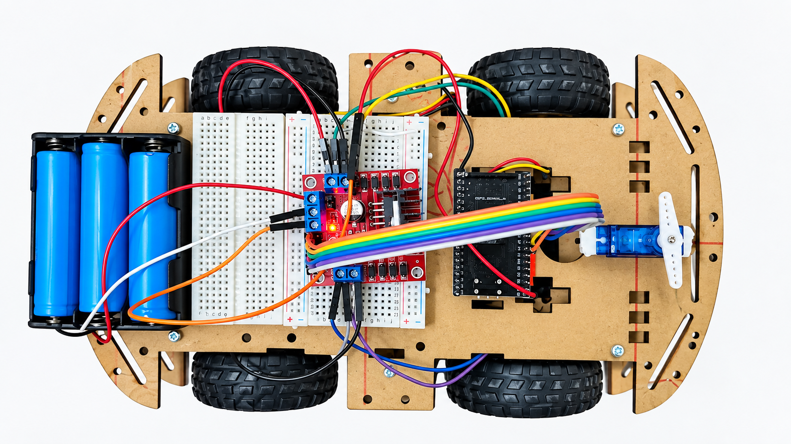

# 🚗 ESP32 Bluetooth RC Car

  
  
  
  
  

### A Wi-Fi & Bluetooth controlled RC car built with an ESP32, an L298N motor driver, and the Dabble app

 

  
   
  <em>Replace this with a real photo of your build — save it at docs/images/car.jpg</em>

---

## 🔎 At a Glance

| | |
|---|---|
| **Platform** | ESP32 — Wi-Fi + Bluetooth |
| **Language** | C++ (Arduino framework) |
| **Control Options** | Dabble app (Bluetooth) or browser (Wi-Fi) |
| **Motor Driver** | L298N dual H-bridge |
| **Skill Areas** | Embedded Systems · Robotics · Electronics |

---

## 📖 Overview

This project turns a standard RC car chassis into a smartphone-controlled robot using an **ESP32** as the brain. It supports two control methods: a **Bluetooth** connection through the Dabble app's on-screen GamePad, and a **Wi-Fi fallback** where the ESP32 hosts its own control webpage — no app install required.

Motor direction and speed are handled by an **L298N dual H-bridge driver**, with PWM-based speed control and a smooth acceleration ramp to avoid current spikes when the motors start.

## ✨ Features

- 📱 Drive from a phone via the **Dabble app** (Bluetooth) or any **browser** (Wi-Fi)
- 🎮 Full directional control — forward, backward, and pivot turns
- 🐢➡️🐇 Gradual speed ramping instead of instant full-power starts
- 🛑 Automatic motor stop if the connection drops (Wi-Fi version)
- 🔌 Built on widely available, beginner-friendly hardware

## 🧰 Hardware Used

| Component | Purpose |
|---|---|
| ESP32 Dev Board | Main controller — Wi-Fi + Bluetooth |
| L298N Motor Driver | Drives the DC motors |
| DC Gear Motors + Chassis | The car itself |
| 7.4–12V Battery Pack | Powers the motors |
| USB Power Bank | Powers the ESP32 independently |

## 🔌 Wiring

| ESP32 Pin | L298N Pin | Purpose |
|---|---|---|
| GPIO 27 | IN1 | Left motor direction |
| GPIO 26 | IN2 | Left motor direction |
| GPIO 25 | IN3 | Right motor direction |
| GPIO 33 | IN4 | Right motor direction |
| GPIO 14 | ENA | Left motor speed (PWM) |
| GPIO 32 | ENB | Right motor speed (PWM) |
| GND | GND | Common ground with battery negative |

> ⚠️ **Power the ESP32 from its own USB source**, separate from the motor battery. Sharing power with the motors can brown out the ESP32 when they start.

## 🛠️ Software Setup

1. Install [Arduino IDE](https://www.arduino.cc/en/software)
2. Add ESP32 board support: *File > Preferences* → add the ESP32 boards URL → install via *Boards Manager*
3. Install the **DabbleESP32** library: *Sketch > Include Library > Manage Libraries* → search "DabbleESP32"
4. Install the **Dabble** app on your phone (Play Store / App Store)
5. Open the `.ino` file from this repo and upload it to your board

## 🎮 How to Drive

1. Open the Dabble app and connect to the car over Bluetooth
2. Open the **GamePad** module
3. Tap and hold the D-pad to drive — release to stop

## 🚀 Future Improvements

- [ ] Obstacle avoidance with an ultrasonic sensor
- [ ] Live camera streaming via an ESP32-CAM
- [ ] Virtual joystick instead of D-pad for finer control
- [ ] Onboard battery voltage monitoring

## 📄 License

This project is licensed under the MIT License — free to use, modify, and share.

## 🙋 Author

**Muhammad Sufyan**
Electrical Engineering, PIEAS
